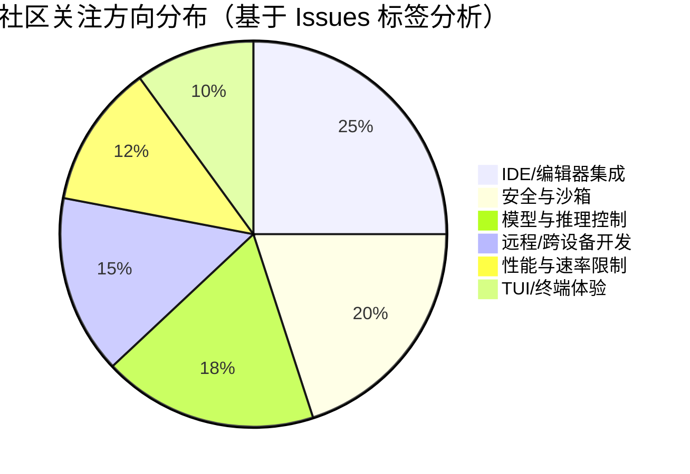

# AI CLI 工具社区动态日报 2026-02-25

> 生成时间: 2026-02-25 01:41 UTC | 覆盖工具: 6 个

- [Claude Code](https://github.com/anthropics/claude-code)
- [OpenAI Codex](https://github.com/openai/codex)
- [Gemini CLI](https://github.com/google-gemini/gemini-cli)
- [Kimi Code CLI](https://github.com/MoonshotAI/kimi-cli)
- [OpenCode](https://github.com/anomalyco/opencode)
- [Qwen Code](https://github.com/QwenLM/qwen-code)

---

## 横向对比

# AI CLI 工具生态横向对比分析报告 | 2026-02-25

---

## 1. 生态全景

当前 AI CLI 工具生态呈现**"三强鼎立、多极追赶"**格局：Claude Code 与 OpenAI Codex 凭借企业级功能与稳定性占据先发优势，Gemini CLI 以激进的 Agent 架构重构寻求差异化突破，Kimi CLI 和 OpenCode 则聚焦特定场景（企业网络适配、多模型兼容）快速迭代。整体技术路线从"单一对话工具"向"Multi-Agent 编排平台"演进，Windows 平台稳定性、企业安全合规、远程开发能力成为共同攻坚方向。Rust 重构（Codex）、Hook 插件化（Claude）、ReAct 循环标准化（Gemini）等技术选型差异，正塑造各工具的长期架构边界。

---

## 2. 各工具活跃度对比

| 工具 | 今日 Issues | 今日 PRs | 版本发布 | 关键动态 |
|:---|:---:|:---:|:---|:---|
| **Claude Code** | 8 个活跃（2 严重回归） | 8 个（3 合并） | v2.1.53 → v2.1.52 连续修复 | Windows Bash 工具严重回归，Hook 生态快速成型 |
| **OpenAI Codex** | 10 个活跃（3 高热度） | 10 个（密集 Rust 迭代） | rust-v0.105.0-alpha.17/18 | 子代理配置里程碑落地，速率限制争议升温 |
| **Gemini CLI** | 10 个活跃 | 10 个（1 架构级） | v0.30.0-preview.6 / v0.29.7 | Agent v1 重构 PR 进入评审，Plan Mode 体验争议 |
| **Kimi CLI** | 6 个活跃（4 连接故障） | 7 个（1 核心合并） | **v1.13.0** | 可重试 Provider 架构发布，Linux 连接问题爆发 |
| **OpenCode** | 10 个活跃 | 10 个（功能密集） | **v1.2.11** | workspace-serve 实验功能，TUI 性能持续优化 |
| **Qwen Code** | — | — | — | 数据获取失败 |

> **活跃度排序**：Codex ≈ Claude Code ≈ Gemini CLI ≈ OpenCode > Kimi CLI

---

## 3. 共同关注的功能方向

| 功能方向 | 涉及工具 | 具体诉求 |
|:---|:---|:---|
| **Windows 平台稳定性** | Claude Code、Codex、Gemini CLI、OpenCode | Claude Bash 工具 EINVAL 回归；Codex IDE 扩展卡顿；Gemini 滚动闪烁；OpenCode 路径/粘贴问题 |
| **企业网络/安全合规** | Claude Code、Codex、Kimi CLI、OpenCode | Kimi SSL_CERT_FILE、Azure 部署；Codex 敏感文件排除；Claude 远程控制权限；OpenCode Bedrock IAM |
| **Multi-Agent 编排** | Codex、Gemini CLI、Claude Code | Codex 子代理配置（#11701 已关闭）；Gemini Agent v1 重构（#19982）；Claude 批量 Agent 终止优化 |
| **会话持久化与恢复** | Claude Code、Gemini CLI、OpenCode | Claude 登出后会话消失；Gemini 退出恢复路径不明；OpenCode `/compact` 数据丢失 |
| **速率限制与计费透明** | Codex、Kimi CLI | Codex 异常消耗 22% 周限额（#12728）；Kimi 413 上下文超限 |
| **远程/跨设备开发** | Codex、Claude Code、Gemini CLI | Codex SSH 远程开发（#10450）；Claude `claude remote-control`；Gemini SSH 工具（#19541） |

---

## 4. 差异化定位分析

| 工具 | 核心功能侧重 | 目标用户画像 | 技术路线特征 |
|:---|:---|:---|:---|
| **Claude Code** | 企业级协作（Cowork）、Hook 插件生态、VS Code 深度集成 | 中大型团队、企业开发者、需定制化工作流 | TypeScript 主导，Hookify 插件系统开放，强调"人机协作"而非全自动化 |
| **OpenAI Codex** | Rust 核心性能、子代理编排、TUI 交互体验、多模型调度 | 性能敏感型开发者、Multi-Agent 场景、OpenAI 生态深度用户 | **Rust 全面重构**，Skills 系统安全管控，Plan/Default 双模式精细化 |
| **Gemini CLI** | Agent 架构平台化、Plan Mode 规划-执行分离、Google 生态原生 | 追求"自动驾驶"编码、Google Cloud 用户、实验性功能爱好者 | **ReAct 循环标准化**，Agent v1 抽象层向 SDK 演进，Conductor 策略引擎 |
| **Kimi CLI** | 网络韧性（可重试 Provider）、企业代理适配、Wire 模式 Agent 控制 | 中国企业用户、网络环境复杂场景、需国产模型支持 | Rust（kosong 框架），Provider 级熔断降级，强调"弱网可用" |
| **OpenCode** | 多模型兼容（Kimi/Gemini/GPT-5/Devstral）、TUI 性能、开放生态 | 多模型策略用户、追求最新模型特性、自托管需求 | TypeScript，模块化提供商体系，快速跟进第三方模型 API 变更 |

---

## 5. 社区热度与成熟度

### 成熟度矩阵（基于 Issue 处理效率 + 功能完整性）

| 工具 | 社区热度 | 迭代速度 | 稳定性 | 文档/生态 | 综合成熟度 |
|:---|:---:|:---:|:---:|:---:|:---:|
| **Claude Code** | ⭐⭐⭐⭐⭐ | ⭐⭐⭐⭐☆ | ⭐⭐⭐☆☆* | ⭐⭐⭐⭐☆ | **高**（Windows 近期拖累） |
| **OpenAI Codex** | ⭐⭐⭐⭐⭐ | ⭐⭐⭐⭐⭐ | ⭐⭐⭐⭐☆ | ⭐⭐⭐☆☆ | **中高**（Rust 重构期波动） |
| **Gemini CLI** | ⭐⭐⭐⭐☆ | ⭐⭐⭐⭐⭐ | ⭐⭐⭐☆☆ | ⭐⭐⭐☆☆ | **中**（架构重构期） |
| **Kimi CLI** | ⭐⭐⭐☆☆ | ⭐⭐⭐⭐☆ | ⭐⭐⭐☆☆* | ⭐⭐⭐☆☆ | **中**（1.13.0 关键升级） |
| **OpenCode** | ⭐⭐⭐⭐☆ | ⭐⭐⭐⭐⭐ | ⭐⭐⭐☆☆ | ⭐⭐⭐⭐☆ | **中高**（功能追赶期） |

*\* 今日有严重回归或集中故障*

### 关键判断

- **最活跃社区**：Claude Code（Hook 生态贡献者涌现）、OpenAI Codex（Rust 重构每日迭代）
- **最快迭代阶段**：Gemini CLI（Agent v1 架构重构）、OpenCode（多模型适配密集）
- **稳定性风险期**：Claude Code（v2.1.53 Windows 回归）、Kimi CLI（1.13.0 Linux 连接故障）

---

## 6. 值得关注的趋势信号

| 趋势信号 | 证据来源 | 开发者参考价值 |
|:---|:---|:---|
| **"Plan Mode" 成为标配，但体验分化** | Claude、Codex、Gemini 均有实现；Gemini #20143 "过于急切进入实现" 获 P1 标注 | 选择工具时需验证：规划-执行边界是否清晰、用户干预点是否充足 |
| **Hook/插件系统从"加分项"变"必选项"** | Claude Hookify 生态（#28294 等）、OpenCode `.agents/skills/` 标准路径诉求 | 评估工具的扩展性架构：是否支持权限拦截、字段映射、自定义工作流 |
| **Rust 成为性能敏感型 CLI 的首选** | Codex 全面 Rust 重构、Kimi CLI 基于 kosong Rust 框架 | 技术选型关注：团队 Rust 能力储备、构建工具链成熟度 |
| **"弱网韧性"成为差异化竞争点** | Kimi 1.13.0 可重试 Provider、Claude 会话恢复焦虑 | 企业部署前需验证：网络抖动场景下的自动恢复机制 |
| **多模型策略倒逼"提供商抽象层"成熟** | OpenCode 10+ 提供商适配、Codex 自定义模型元数据问题 | 避免 vendor lock-in：选择提供商接口标准化的工具 |
| **Windows 开发者体验仍是行业短板** | 5 个工具均有 Windows 专属 Issue，且密度显著高于 macOS/Linux | 跨平台团队需预留 Windows 专项测试资源，或优先选择 WSL 方案 |

---

*报告基于 2026-02-25 公开社区数据生成，建议结合具体场景进行 PoC 验证*

---

## 各工具详细报告

<details>
<summary><strong>Claude Code</strong> — <a href="https://github.com/anthropics/claude-code">anthropics/claude-code</a></summary>

# Claude Code 社区动态日报 | 2026-02-25

## 今日速览

今日社区聚焦两大主题：**Windows 平台 Bash 工具严重回归故障**（v2.1.53 多个相关 Issue 爆发），以及 **VS Code 扩展命令注册问题**已在 v2.1.52 紧急修复。同时，远程控制功能（`claude remote-control`）对个人账户的错误提示引发用户体验争议，社区呼吁更清晰的权限说明。

---

## 版本发布

### v2.1.53 → v2.1.52 连续修复
| 版本 | 关键修复 |
|:---|:---|
| **v2.1.53** | 修复 UI 闪烁（输入提交后短暂消失）、批量 Agent 终止通知聚合、优雅关闭问题 |
| **v2.1.52** | **紧急修复**：VS Code 扩展在 Windows 上崩溃（`command 'claude-vscode.editor.openLast' not found`）|

🔗 [v2.1.53 Release](https://github.com/anthropics/claude-code/releases/tag/v2.1.53) | [v2.1.52 Release](https://github.com/anthropics/claude-code/releases/tag/v2.1.52)

> ⚠️ **注意**：v2.1.53 引入了新的 Windows Bash 工具回归，详见下方 Issues。

---

## 社区热点 Issues

### 🔴 严重回归（需立即关注）

| # | 标题 | 状态 | 评论 | 核心问题 |
|:---|:---|:---|:---:|:---|
| [#28333](https://github.com/anthropics/claude-code/issues/28333) | Bash 工具在 Windows 完全失效：`EINVAL: invalid argument` | 🟡 OPEN | 6 | **v2.1.53 关键回归**——任何 Bash 命令均失败，临时文件路径创建异常 |
| [#28343](https://github.com/anthropics/claude-code/issues/28343) | Bash 工具 EINVAL 持续存在——v2.1.45 的 stdio fd 回归未完全修复 | 🟡 OPEN | 2 | 追溯 v2.1.45 系列问题，Git Bash/Scoop 安装环境受影响 |
| [#28344](https://github.com/anthropics/claude-code/issues/28344) | `EINVAL` 在非 C: 驱动器上失败 | 🟢 CLOSED | 3 | 路径含连字符或跨驱动器时触发，已快速关闭但关联问题持续 |
| [#28347](https://github.com/anthropics/claude-code/issues/28347) | 工作目录含连字符时 Bash 失败 | 🟢 CLOSED | 2 | 与 #28344 类似，降级至 v2.1.52 可恢复 |

### 🔶 高互动议题

| # | 标题 | 状态 | 评论/👍 | 社区焦点 |
|:---|:---|:---|:---:|:---|
| [#26805](https://github.com/anthropics/claude-code/issues/26805) | Cowork UI：响应不渲染、"working through complex response" 无限挂起 | 🟢 CLOSED | 44/24 | **已解决**——协作模式核心体验问题，修复获社区认可 |
| [#20696](https://github.com/anthropics/claude-code/issues/20696) | 对话压缩间歇性失败或死锁（1月15日后回归） | 🟡 OPEN | 36/8 | **长期顽疾**——影响 claude.ai 网页/移动端，跨平台上下文管理危机 |
| [#28098](https://github.com/anthropics/claude-code/issues/28098) | `claude remote-control` 对个人账户显示误导性"联系管理员"错误 | 🟡 OPEN | 21/14 | **UX 设计缺陷**——Pro/Max 用户无管理员可联系，权限模型不清晰 |
| [#21576](https://github.com/anthropics/claude-code/issues/21576) | 任务执行逃逸至 PowerShell 后无响应 | 🟡 OPEN | 21/1 | Windows 平台稳定性，任务执行流失控 |
| [#26452](https://github.com/anthropics/claude-code/issues/26452) | 登出/重启后会话消失——如何紧急恢复？ | 🟡 OPEN | 20/8 | **数据安全焦虑**——用户会话持久化机制受质疑 |
| [#26638](https://github.com/anthropics/claude-code/issues/26638) | 桌面应用启动后崩溃，8 个 claude.exe 进程无响应 | 🟢 CLOSED | 14/31 | Windows 多进程架构稳定性问题，高 👍 反映普遍影响 |

---

## 重要 PR 进展

| # | 标题 | 状态 | 核心贡献 |
|:---|:---|:---|:---|
| [#28294](https://github.com/anthropics/claude-code/pull/28294) | 为管道命令权限添加 PermissionRequest Hook 变通方案 | 🟡 OPEN | 解决 Plan Agent 对白名单管道命令仍提示权限的回归问题，提供 `examples/hooks/piped_command_permission_fix.py` |
| [#28065](https://github.com/anthropics/claude-code/pull/28065) | 批量修复小型开放 PR（Hookify 字段映射、Python 3.8 兼容等） | 🟡 OPEN | 整合 #24321 等社区贡献：修复 Write/Edit 字段映射、`|` 联合类型语法、未定义变量引用 |
| [#28062](https://github.com/anthropics/claude-code/pull/28062) | 批量修复可操作的社区 PR（Hookify 导入路径等） | 🟡 OPEN | 整合 #27796：将 `hookify.core.*` 改为 `core.*`，解决 `No module named 'hookify'` 错误 |
| [#28088](https://github.com/anthropics/claude-code/pull/28088) | 修复 hookify 插件中的错误 Python 导入路径 | 🟢 CLOSED | 解决 `CLAUDE_PYTHON_PATH` 环境下绝对导入失败问题 |
| [#28243](https://github.com/anthropics/claude-code/pull/28243) | 添加非写入用户检查工作流 | 🟢 CLOSED | 安全增强：检测 `allowed_non_write_users` 修改并触发安全审查评论 |
| [#27911](https://github.com/anthropics/claude-code/pull/27911) | 在 Issue 分类中使用包装脚本进行标签操作 | 🟢 CLOSED | 将分类提示提取为 `/triage-issue` 命令，使用 `edit-issue-labels.sh` 替代原始 `gh issue edit`，带标签验证 |
| [#26565](https://github.com/anthropics/claude-code/pull/26565) | Claude/通用会话 dg oce | 🟡 OPEN | 会话管理相关（具体细节待补充）|
| [#28355](https://github.com/anthropics/claude-code/pull/28355) | 通过上传添加文件 | 🟡 OPEN | 内容待明确（新提交）|

---

## 功能需求趋势

基于 50 条活跃 Issue 分析，社区关注优先级：

```
1. 【稳定性】Windows 平台工具链可靠性  ████████████████████  爆发式增长
2. 【核心体验】对话压缩与上下文管理    ████████████████░░░░░  长期痛点
3. 【IDE 集成】VS Code 扩展健壮性      ██████████████░░░░░░░  近期紧急
4. 【权限模型】远程控制与账户体系清晰  ██████████░░░░░░░░░░░  新功能磨合
5. 【数据安全】会话持久化与恢复机制    █████████░░░░░░░░░░░░  用户焦虑
6. 【跨平台】WSL 支持（Windows 高级用户）██████░░░░░░░░░░░░░░░  差异化需求
```

**新兴趋势**：Hook 系统（`hookify`）的插件化生态正在形成，社区贡献集中在权限拦截、字段映射、导入路径等扩展点。

---

## 开发者关注点

### 🔥 即时痛点
| 问题 | 影响范围 | 临时方案 |
|:---|:---|:---|
| **Bash 工具 EINVAL** | Windows v2.1.53 用户 | **降级至 v2.1.52** |
| **VS Code 命令未找到** | Windows 扩展用户 | 更新至 v2.1.52+ |
| **会话丢失** | 桌面端用户 | 避免主动登出，关注自动保存状态 |

### 📣 高频诉求
1. **更透明的发布说明**——v2.1.53 Bash 回归未在 changelog 预警
2. **Windows 专项 QA 流程**——近期 Windows 专属 bug 密度显著高于 macOS/Linux
3. **远程控制权限文档**——个人账户与企业账户的能力边界需明确区分
4. **Hook 开发文档**——插件系统增长迅速，官方最佳实践指南缺失
5. **对话压缩可视化**——用户希望了解何时/如何被压缩，而非被动接受

### 💡 技术债务信号
- 临时文件路径处理（`C:\Users\...\AppData\Local\Temp\claude\...`）在 Windows 上多次出现编码/特殊字符问题
- `tmux` 集成在团队 Agent 场景存在竞态条件（shell 初始化时序）
- 成本计量指标（`cost_usage_total`）模型定价映射错误，影响企业用户账单信任

---

*日报基于 GitHub 公开数据生成，不代表 Anthropic 官方立场。*

</details>

<details>
<summary><strong>OpenAI Codex</strong> — <a href="https://github.com/openai/codex">openai/codex</a></summary>

# OpenAI Codex 社区动态日报 | 2026-02-25

## 今日速览

今日社区聚焦 **Rust 核心重构** 与 **多平台稳定性修复**。官方连发两个 Rust alpha 版本（v0.105.0-alpha.17/18），同时 TUI 快捷键兼容性、沙箱权限控制和模型切换体验成为 PR 重点。Issues 端，速率限制异常消耗和远程开发需求持续升温。

---

## 版本发布

### rust-v0.105.0-alpha.18 & alpha.17
| 版本 | 发布时间 |
|:---|:---|
| [v0.105.0-alpha.18](https://github.com/openai/codex/releases/tag/rust-v0.105.0-alpha.18) | 2026-02-25 |
| [v0.105.0-alpha.17](https://github.com/openai/codex/releases/tag/rust-v0.105.0-alpha.17) | 2026-02-25 |

> 注：Release notes 较为简略，具体变更需结合 PR 分析。从关联 PR 看，主要涉及 musl 构建修复、OAuth 权限调整及 shell 权限升级机制重构。

---

## 社区热点 Issues（Top 10）

| # | 状态 | 主题 | 热度 | 关键看点 |
|:---|:---|:---|:---|:---|
| [#11701](https://github.com/openai/codex/issues/11701) | ✅ CLOSED | 子代理配置与编排 | 👍38 / 💬60 | **里程碑功能落地**：支持通过 `~/.codex/config.toml` 配置子代理模型与推理强度，社区长期呼吁的 Multi-Agent 编排能力进入可用阶段 |
| [#2847](https://github.com/openai/codex/issues/2847) | 🟡 OPEN | 敏感文件排除机制 | 👍214 / 💬54 | **安全刚需**：`node_modules/` 等目录的搜索与隐私保护矛盾，社区建议 `.codexignore` + 全局忽略双轨方案 |
| [#2558](https://github.com/openai/codex/issues/2558) | 🟡 OPEN | Zellij 终端滚动截断 | 👍76 / 💬35 | **终端兼容性**：TUI 在终端复用器中的渲染问题，影响主流开发工作流 |
| [#10450](https://github.com/openai/codex/issues/10450) | 🟡 OPEN | 桌面版 SSH 远程开发 | 👍189 / 💬25 | **VS Code 用户迁移障碍**：Codex Desktop 缺乏 Remote-SSH 等价能力，阻碍服务器端开发场景 |
| [#12674](https://github.com/openai/codex/issues/12674) | ✅ CLOSED | 速率限制误触发 | 👍15 / 💬15 | **服务端问题**：429 错误在限额充足时出现，官方快速响应关闭 |
| [#12092](https://github.com/openai/codex/issues/12092) | 🟡 OPEN | 桌面版自动滚动失效 | 👍12 / 💬13 | **回归 Bug**：v26.217.1959 更新后体验降级，影响长对话浏览 |
| [#12100](https://github.com/openai/codex/issues/12100) | ✅ CLOSED | 自定义模型元数据缺失 | 👍3 / 💬17 | **OCA 生态**：`oca/gpt-5-codex` 模型识别问题，第三方提供商集成痛点 |
| [#10571](https://github.com/openai/codex/issues/10571) | 🟡 OPEN | "Bad request" 神秘错误 | 👍1 / 💬13 | **诊断困难**：GPT-5.2 xhigh 特定场景报错，缺乏有效错误信息 |
| [#9224](https://github.com/openai/codex/issues/9224) | 🟡 OPEN | CLI 远程控制 | 👍30 / 💬8 | **跨设备协同**：通过手机 ChatGPT App 控制桌面 Codex CLI，已有社区 workaround |
| [#12728](https://github.com/openai/codex/issues/12728) | 🟡 OPEN | 速率限制异常消耗 | 👍0 / 💬3 | **计费焦虑**：用户报告单日消耗 22% 周限额，使用模式未变，疑似后台计费变更 |

---

## 重要 PR 进展（Top 10）

| # | 作者 | 核心变更 | 技术价值 |
|:---|:---|:---|:---|
| [#12706](https://github.com/openai/codex/pull/12706) | @charley-oai | **Default 模式启用 `request_user_input`** | 打破 Plan 模式独占交互限制，Default 模式也可主动询问用户 |
| [#12730](https://github.com/openai/codex/pull/12730) | @bolinfest | **Shell 升级检查 Skill 策略** | 安全加固：Skill 脚本执行需显式用户批准，防止静默提权 |
| [#12719](https://github.com/openai/codex/pull/12719) | @bolinfest | **Arg0DispatchPaths 传递 helper 可执行路径** | 消除 `PATH` 扫描的脆弱性，提升跨环境可靠性 |
| [#12727](https://github.com/openai/codex/pull/12727) | @charley-oai | **TUI resume/fork 使用 thread_id 解析** | 会话管理精确化，解决多线程场景下的工作目录歧义 |
| [#12725](https://github.com/openai/codex/pull/12725) | @fjord-oai | **修复 js_repl 嵌套工具调用中的图片附件** | 恢复 `view_image` 在 JS REPL 中的预期行为 |
| [#12720](https://github.com/openai/codex/pull/12720) | @sayan-oai | **musl 构建添加 `AWS_LC_SYS_NO_JITTER_ENTROPY=1`** | 紧急修复 Rust 发布流水线，解除 jitterentropy 链接阻塞 |
| [#12715](https://github.com/openai/codex/pull/12715) | @aibrahim-oai | **App-server v2 实时对话 API** | 实验性实时会话接口，为语音/流式交互铺路 |
| [#12703](https://github.com/openai/codex/pull/12703) | @fcoury | **Ctrl+O 快速切换最近模型** | 体验优化：5.3-spark 发布后，快慢模型切换需求激增 |
| [#12702](https://github.com/openai/codex/pull/12702) | @viyatb-oai | **macOS Seatbelt 网络与 Unix Socket 处理改进** | 沙箱安全细化：双栈本地绑定 + 显式 AF_UNIX 权限 |
| [#12660](https://github.com/openai/codex/pull/12660) | @alexsong-oai | **外部代理配置检测与导入** | 生态互操作：自动识别并导入第三方 Agent 配置 |

---

## 功能需求趋势



**三大主线**：
1. **企业级安全** — 敏感文件隔离（#2847）、沙箱权限细化（#12702）、Skill 执行管控（#12730）
2. **灵活模型调度** — 子代理编排（#11701）、模型快速切换（#12703）、自定义模型元数据（#12380）
3. **远程开发闭环** — SSH 远程主机（#10450）、CLI 远程控制（#9224）、跨设备会话同步

---

## 开发者关注点

| 痛点 | 代表 Issue | 社区诉求 |
|:---|:---|:---|
| **速率限制黑箱** | #12674, #12728, #4095 | 限额消耗可视化，异常计费可申诉 |
| **错误信息不透明** | #10571, #12114 | "Bad request" 等错误需附详细上下文 |
| **Windows 二等公民** | #12161, #12673 | IDE 扩展卡顿、构建挂起问题集中 |
| **上下文窗口焦虑** | #9046, #11440 | 413/上下文耗尽后的优雅降级机制 |
| **第三方生态兼容** | #12100, #12114, #12669 | OpenRouter、vLLM 等非官方端点支持 |

---

*日报基于 GitHub 公开数据生成，不代表 OpenAI 官方立场。*

</details>

<details>
<summary><strong>Gemini CLI</strong> — <a href="https://github.com/google-gemini/gemini-cli">google-gemini/gemini-cli</a></summary>

# Gemini CLI 社区动态日报 | 2026-02-25

---

## 1. 今日速览

今日社区聚焦 **Plan Mode 体验优化** 与 **Agent 架构演进**：v0.30.0-preview.6 和 v0.29.7 双版本发布修复关键补丁，同时 Agent v1 核心重构 PR 进入评审阶段。开发者高频反馈 Plan Mode "过于急切进入实现阶段" 和交互体验瑕疵，显示功能成熟度仍是当前首要攻坚方向。

---

## 2. 版本发布

| 版本 | 类型 | 核心更新 |
|:---|:---|:---|
| **[v0.30.0-preview.6](https://github.com/google-gemini/gemini-cli/releases/tag/v0.30.0-preview.6)** | 预览版补丁 | Cherry-pick 修复 d96bd05，延续 preview.5 的稳定性改进 |
| **[v0.30.0-nightly.20260224](https://github.com/google-gemini/gemini-cli/releases/tag/v0.30.0-nightly.20260224.544df749a)** | 夜间构建 | 核心重构：会话转换逻辑迁移至 core 层；修复手动模型选择在重启后未持久化的问题 |
| **[v0.29.7](https://github.com/google-gemini/gemini-cli/releases/tag/v0.29.7)** | 稳定版补丁 | 同 preview.6 的修复内容，面向 v0.29 稳定分支 |

> **注**：v0.30.0-nightly 包含的 "Persist manual model selection on restart" 修复同步解决了社区长期抱怨的配置丢失问题。

---

## 3. 社区热点 Issues

| # | 标题 | 优先级 | 评论 | 关键价值 |
|:---|:---|:---|:---:|:---|
| [#20142](https://github.com/google-gemini/gemini-cli/issues/20142) | AskUser 开放问题不支持 Ctrl+R 搜索历史 | need-triage | 8 | **高频交互痛点**：用户在长对话中无法快速回溯历史输入，严重影响多轮任务效率 |
| [#20143](https://github.com/google-gemini/gemini-cli/issues/20143) | Plan Mode 过于急切进入实现阶段 | **P1** | 5 | **核心体验缺陷**：Agent 在规划未完成时即跳转编码，破坏"先规划后执行"的设计初衷 |
| [#20177](https://github.com/google-gemini/gemini-cli/issues/20177) | AskUser 被用于确认 shell 命令而非标准工具确认 | need-triage | 4 | **交互一致性**：破坏用户心智模型，增加认知负担 |
| [#20181](https://github.com/google-gemini/gemini-cli/issues/20181) | AskUser 开放问题需支持外部编辑器 | need-triage | 3 | 长文本输入场景（如 Conductor track 描述）的刚需 |
| [#19514](https://github.com/google-gemini/gemini-cli/issues/19514) | Plan Mode 下 AskUser 输出原始标签 | area/core | 3 | 渲染层 Bug，直接影响 Plan Mode 的可读性 |
| [#18953](https://github.com/google-gemini/gemini-cli/issues/18953) | 复杂 shell 命令执行极慢 | **P2** | 3 | 性能瓶颈：进度条等"UX 魔法"导致 100 倍减速，企业级场景受阻 |
| [#18896](https://github.com/google-gemini/gemini-cli/issues/18896) | Windows 滚动时屏幕闪烁/故障 | **P2** | 3 | 跨平台稳定性问题，Windows 用户核心体验受损 |
| [#20195](https://github.com/google-gemini/gemini-cli/issues/20195) | [Agents] 本地 Subagent Sprint 1 | area/agent | 2 | **架构里程碑**：多 Agent 协作的基础设施建设启动 |
| [#20233](https://github.com/google-gemini/gemini-cli/issues/20233) | 远程与本地 Subagent 实验分离 | need-triage | 1 | 安全与实验性功能的隔离设计，影响未来扩展架构 |
| [#20219](https://github.com/google-gemini/gemini-cli/issues/20219) | 终端快照测试需支持颜色信息 | need-triage | 1 | 工程质量：防止颜色回归，支撑新渲染器迁移 |

---

## 4. 重要 PR 进展

| # | 标题 | 状态 | 核心贡献 |
|:---|:---|:---|:---|
| [#19982](https://github.com/google-gemini/gemini-cli/pull/19982) | Agent & AgentSession v1：ReAct 循环与事件流 | **OPEN** | **架构基石**：首个可复用的 Agent 抽象层，支持 SDK 化调用和细粒度事件观测 |
| [#20082](https://github.com/google-gemini/gemini-cli/pull/20082) | 交互式 shell 自动补全 | OPEN | 类 readline 的 Tab 补全，覆盖文件/目录/命令路径，提升终端效率 |
| [#20220](https://github.com/google-gemini/gemini-cli/pull/20220) | 支持颜色信息的快照测试 | OPEN | SVG 快照捕获 ANSI 颜色，解决回归测试盲区（关联 #20219） |
| [#19541](https://github.com/google-gemini/gemini-cli/pull/19541) | 内置 SSH 工具支持远程设备访问 | OPEN | 直接执行远程命令并实时分析输出，扩展 DevOps 场景 |
| [#19812](https://github.com/google-gemini/gemini-cli/pull/19812) | Headless 自动模式（/auto 别名 /headless） | OPEN | 交互会话中执行单轮 headless 任务，自动取消确认并退出 |
| [#20229](https://github.com/google-gemini/gemini-cli/pull/20229) | 扩展并行加载优化 | OPEN | ExtensionManager 并发加载，显著改善多扩展启动性能 |
| [#19389](https://github.com/google-gemini/gemini-cli/pull/19389) | 隐藏思考中快捷键提示 + 防抖防闪烁 | OPEN | 解决 alternate buffer 模式下的视觉干扰问题 |
| [#19365](https://github.com/google-gemini/gemini-cli/pull/19365) | MCP 工具输出截断 + Unicode 安全 | OPEN | 防止大输出撑爆上下文，多字节字符截断安全 |
| [#20244](https://github.com/google-gemini/gemini-cli/pull/20244) | Arch Linux (pacman) 安装文档 | OPEN | 社区贡献：完善 Linux 发行版覆盖 |
| [#20240](https://github.com/google-gemini/gemini-cli/pull/20240) | Plan Mode 自动模型切换 | **CLOSED** | 规划期用 Pro、实现期用 Flash 的路由策略（已合并或关闭） |

---

## 5. 功能需求趋势

基于 50 条活跃 Issue 的聚类分析：

| 趋势方向 | 热度 | 典型诉求 |
|:---|:---:|:---|
| **Plan Mode 精细化控制** | 🔥🔥🔥 | 节奏控制（避免过早实现）、编辑器集成、历史搜索、标签渲染修复 |
| **Agent 架构扩展** | 🔥🔥🔥 | Subagent 本地/远程分离、多 Agent 协作、ReAct 循环标准化 |
| **终端交互体验** | 🔥🔥🔥 | 滚动性能（Windows 闪烁）、颜色测试、防抖、自动补全 |
| **上下文与性能优化** | 🔥🔥 | 大输出截断、Token 节俭读取（Tactful Extraction）、智能分页 |
| **Headless/CI 集成** | 🔥🔥 | 策略引擎支持 headless、自动模式、会话恢复指引 |
| **扩展与策略生态** | 🔥 | 扩展并行加载、策略文件打包、Conductor 策略支持 |

---

## 6. 开发者关注点

### 🔴 高频痛点
1. **Plan Mode 心智负担**："Agent 太急着写代码"（#20143）与"反复询问是否进入 Plan Mode"（#19312）并存，显示状态机逻辑需重新校准
2. **Windows 二等公民体验**：滚动闪烁（#18896）、路径输入闪烁（#20217）等渲染问题集中爆发
3. **长任务执行黑箱**：shell 命令输出过大时无智能处理，导致假死或误触发循环检测（#19519, #19520）

### 🟡 能力缺口
- **会话连续性**：退出后恢复路径不明确（#19379），影响长周期开发工作流
- **模型选择持久化**：虽已修复（v0.30.0-nightly），但历史债务显示配置管理仍需加固

### 🟢 积极信号
- **Agent v1 架构**（#19982）和 **Subagent Sprint**（#20195）显示团队正从"功能堆砌"转向"平台化架构"
- **社区贡献活跃**：SSH 工具、Arch 安装指南、自动补全等 PR 体现生态扩展意愿

---

*日报基于 github.com/google-gemini/gemini-cli 2026-02-25 数据生成*

</details>

<details>
<summary><strong>Kimi Code CLI</strong> — <a href="https://github.com/MoonshotAI/kimi-cli">MoonshotAI/kimi-cli</a></summary>

# Kimi Code CLI 社区动态日报 | 2026-02-25

---

## 1. 今日速览

**Kimi CLI 1.13.0 正式发布**，核心升级是可重试的 Chat Provider 接口与自动恢复机制，显著提升网络不稳定场景下的可靠性。社区今日集中反馈 **Linux 平台连接错误问题**，多个 Issue 指向 HTTP Header 污染或企业代理环境兼容性，相关修复 PR 已提交待审。

---

## 2. 版本发布

### [v1.13.0](https://github.com/MoonshotAI/kimi-cli/releases/tag/1.13.0) | 2026-02-24

| 组件 | 版本 |
|:---|:---|
| kimi-cli | 1.12.0 → **1.13.0** |
| kimi-code | 同步至 1.13.0 |
| kosong | 0.42.0 → **0.43.0** |

**核心更新：**
- **可重试 Chat Provider 接口**（[#1219](https://github.com/MoonshotAI/kimi-cli/pull/1219)）：实现 Provider 级别的自动重试与故障恢复，降低因瞬时网络波动导致的对话中断
- 依赖升级至 kosong 0.43.0

---

## 3. 社区热点 Issues

| # | 标题 | 状态 | 关键信息 |
|:---|:---|:---|:---|
| [#1217](https://github.com/MoonshotAI/kimi-cli/issues/1217) | 图片处理 hang 住卡死 | 🔴 Open | **v1.12.0 / macOS ARM**，多模态场景阻塞问题，影响图片输入工作流 |
| [#1227](https://github.com/MoonshotAI/kimi-cli/issues/1227) | LLM provider error: Connection error | 🔴 Open | **v1.13.0 / Ubuntu 22.04**，新版本发布后仍出现，需排查回退 |
| [#1226](https://github.com/MoonshotAI/kimi-cli/issues/1226) | LLM provider error: Connection error | 🔴 Open | 同上，配置确认无误仍失败，疑似网络层或认证层问题 |
| [#1220](https://github.com/MoonshotAI/kimi-cli/issues/1220) | HTTP Header 被 Ubuntu 内核版本字符串污染 | 🔴 Open | **根因分析型**，`Linux 6.8.0-100-generic` 被注入 Header 导致协议解析失败，关联 [#1229](https://github.com/MoonshotAI/kimi-cli/pull/1229) 修复 |
| [#1224](https://github.com/MoonshotAI/kimi-cli/issues/1224) | JetBrains IDEA 中用不了 | 🔴 Open | IDE 集成场景，v25.3.2 兼容性问题，截图待补充 |
| [#1222](https://github.com/MoonshotAI/kimi-cli/issues/1222) | 413 Request Entity Too Large | 🔴 Open | **v1.12.0 / Linux**，上下文或文件上传体积超限，需分块策略优化 |

**趋势判断**：今日 6 个活跃 Issue 中，**4 个为连接/网络层故障**，集中爆发于 Linux 环境，与 1.13.0 发布时间点重合，建议优先排查版本升级引入的 HTTP 客户端变更。

---

## 4. 重要 PR 进展

| # | 标题 | 状态 | 功能/修复要点 |
|:---|:---|:---|:---|
| [#1219](https://github.com/MoonshotAI/kimi-cli/pull/1219) | 可重试 Chat Provider 接口与恢复机制 | ✅ Merged | **核心架构升级**：Provider 层实现指数退避重试、熔断降级、状态恢复 |
| [#1221](https://github.com/MoonshotAI/kimi-cli/pull/1221) | 版本 bump 至 1.13.0 | ✅ Merged | 发布流水线，同步 kosong 0.43.0 |
| [#1229](https://github.com/MoonshotAI/kimi-cli/pull/1229) | 修复 HTTP Header 空白字符导致 h11 拒绝 | 🔍 Open | **紧急修复**：`strip()` 处理 Header 值，直接回应 [#1220](https://github.com/MoonshotAI/kimi-cli/issues/1220) |
| [#1228](https://github.com/MoonshotAI/kimi-cli/pull/1228) | Wire 模式新增 steer 支持 | 🔍 Open | **Agent 控制增强**：JSON-RPC 方法注入用户指令，采用合成 tool result 机制保持思维链连贯 |
| [#1223](https://github.com/MoonshotAI/kimi-cli/pull/1223) | Azure Kimi 支持 default_query/custom_headers | 🔍 Open | **企业部署**：OpenAI 兼容层扩展，支持 Azure 自定义查询参数与头部 |
| [#762](https://github.com/MoonshotAI/kimi-cli/pull/762) | 支持 SSL_CERT_FILE 环境变量 | 🔍 Open | **企业代理**：Zscaler/BlueCoat/Fortinet 等场景证书信任问题 |
| [#1218](https://github.com/MoonshotAI/kimi-cli/pull/1218) | 新增 bell_on_completion 配置 | 🔍 Open | **UX 增强**：任务完成时播放 `\a` 铃声，对标 Codex/Claude CLI，适配 tmux 多窗口场景 |
| [#1225](https://github.com/MoonshotAI/kimi-cli/pull/1225) | 文档：补充三种使用模式说明 | 🔍 Open | 结构化介绍 Interactive CLI / Kimi Web / Kimi ACP 三种交互形态 |

---

## 5. 功能需求趋势

基于近期社区反馈，三大方向热度上升：

| 方向 | 代表 Issue/PR | 需求强度 |
|:---|:---|:---:|
| **企业网络环境适配** | [#762](https://github.com/MoonshotAI/kimi-cli/pull/762) [#1223](https://github.com/MoonshotAI/kimi-cli/pull/1223) [#1229](https://github.com/MoonshotAI/kimi-cli/pull/1229) | ⭐⭐⭐⭐⭐ |
| **IDE 深度集成** | [#1224](https://github.com/MoonshotAI/kimi-cli/issues/1224) JetBrains 问题 | ⭐⭐⭐⭐☆ |
| **Agent 可观测性与控制** | [#1228](https://github.com/MoonshotAI/kimi-cli/pull/1228) steer 指令 [#1218](https://github.com/MoonshotAI/kimi-cli/pull/1218) 完成通知 | ⭐⭐⭐⭐☆ |
| **多模态稳定性** | [#1217](https://github.com/MoonshotAI/kimi-cli/issues/1217) 图片 hang 死 | ⭐⭐⭐☆☆ |

---

## 6. 开发者关注点

### 🔴 高频痛点

1. **Linux 连接稳定性**（今日爆发）
   - 表现：v1.13.0 升级后 Ubuntu 用户集中报告 `Connection error`
   - 疑似根因：HTTP Header 处理变更与内核版本字符串冲突
   - 进展：[#1229](https://github.com/MoonshotAI/kimi-cli/pull/1229) 已提交修复，待合并

2. **企业代理/证书配置**
   - 长期需求：SSL_CERT_FILE 支持、自定义 Header、Azure 部署
   - 进展：多个 PR 并行推进，但 [#762](https://github.com/MoonshotAI/kimi-cli/pull/762) 已滞留近 1 个月

3. **上下文体积管理**
   - [#1222](https://github.comgithub.com/MoonshotAI/kimi-cli/issues/1222) 413 错误反映大文件/长对话场景缺乏自动分块

### 🟡 体验优化诉求

- **异步任务感知**：tmux/后台运行时的完成通知（[#1218](https://github.com/MoonshotAI/kimi-cli/pull/1218) 方案待审）
- **Agent 干预能力**：运行中注入指令而非重启会话（[#1228](https://github.com/MoonshotAI/kimi-cli/pull/1228) steer 机制）

---

*日报生成时间：2026-02-25*  
*数据来源：github.com/MoonshotAI/kimi-cli*

</details>

<details>
<summary><strong>OpenCode</strong> — <a href="https://github.com/anomalyco/opencode">anomalyco/opencode</a></summary>

# OpenCode 社区动态日报 | 2026-02-25

---

## 今日速览

今日 OpenCode 发布 v1.2.11 版本，新增实验性 `workspace-serve` 命令并修复多项 Windows 兼容性问题。社区讨论热度集中在 Kimi K2 系列模型在 AWS Bedrock 的集成故障、TUI 性能优化需求，以及会话数据存储架构的改进提案。

---

## 版本发布

### v1.2.11
| 属性 | 内容 |
|:---|:---|
| 发布日期 | 2026-02-24 |
| 核心更新 | • 新增 `workspace-serve` 命令（实验性）<br>• ACP 实时与负载共享合成待处理状态<br>• 测试环境用展开运算符替代 `structuredClone` 处理 `process.env`<br>• Windows NTFS mtime 精度断言增加 50ms 容错 |

---

## 社区热点 Issues

| # | 标题 | 状态 | 评论 | 关键价值 |
|:---|:---|:---|:---|:---|
| [#1505](https://github.com/anomalyco/opencode/issues/1505) | Shift+Enter 键位失效 | 🔴 CLOSED | 114 | **最高热度修复**：TUI 输入体验的核心交互问题，88 👍 反映用户强烈关注 |
| [#2987](https://github.com/anomalyco/opencode/issues/2987) | `/compact` 命令导致会话全部丢失 | 🟡 OPEN | 27 | **数据安全红线**：会话持久化机制的可靠性缺陷，用户数据风险 |
| [#4832](https://github.com/anomalyco/opencode/issues/4832) | Gemini 3 Pro 函数调用缺少 `thoughtSignature` | 🔴 CLOSED | 24 | 模型能力适配：Google 新模型特性的跟进支持 |
| [#14334](https://github.com/anomalyco/opencode/issues/14334) | v1.2.7 黑屏问题 | 🟡 OPEN | 19 | 桌面端稳定性：跨平台（Mac/Windows）渲染故障 |
| [#11210](https://github.com/anomalyco/opencode/issues/11210) | Kimi K2 via Bedrock 执行中断 | 🟡 OPEN | 16 | 国产模型集成：AWS Bedrock 适配的 ContentBlock 空值处理 |
| [#13807](https://github.com/anomalyco/opencode/issues/13807) | Kimi K2.5 Bedrock 提前 `end_turn` | 🟡 OPEN | 13 | 工具调用链断裂：Converse API 解析缺陷导致多轮工具调用失败 |
| [#5474](https://github.com/anomalyco/opencode/issues/5474) | `/undo` 仅回滚消息不回滚文件 | 🟡 OPEN | 12 | 状态一致性：对话与文件系统操作的原子性缺失 |
| [#10986](https://github.com/anomalyco/opencode/issues/10986) | 支持 `.agents/skills/` 标准路径 | 🟡 OPEN | 11 | 生态标准化：Agent Skills 目录规范的社区共识推进 |
| [#13546](https://github.com/anomalyco/opencode/issues/13546) | GPT-5 系列 `reasoningSummary` 参数兼容 | 🟡 OPEN | 7 | 第三方提供商适配：OpenAI 兼容层参数注入过于激进 |
| [#13838](https://github.com/anomalyco/opencode/issues/13838) | 压缩回放注入伪用户消息 | 🟡 OPEN | 4 | 上下文污染：`/compact` 机制引入非预期模型行为 |

---

## 重要 PR 进展

| # | 标题 | 作者 | 类型 | 核心贡献 |
|:---|:---|:---|:---|:---|
| [#14974](https://github.com/anomalyco/opencode/pull/14974) | 升级 opentui 至 v0.1.82，默认激活 Markdown 渲染 | @kommander | 功能 | TUI 体验升级：Markdown 可视化能力默认启用 |
| [#13968](https://github.com/anomalyco/opencode/pull/13968) | 分离 TUI/Server 配置 | @kommander | 架构 | 解耦服务端与客户端配置，提升部署灵活性 |
| [#14987](https://github.com/anomalyco/opencode/pull/14987) | 配置环境变量占位符 JSON 转义 | @chindris-mihai-alexandru | 修复 | 解决 `#14986`：特殊字符导致配置解析失败 |
| [#14969](https://github.com/anomalyco/opencode/pull/14969) | Bedrock IAM 凭证连接流程 | @tristan-stahnke-GPS | 修复 | 替换 API Key 表单，支持 AWS 标准 IAM 认证 |
| [#14647](https://github.com/anomalyco/opencode/pull/14647) | 阻止 Copilot 400 空工具描述 | @amsminn | 修复 | MCP/OpenAI 兼容工具空描述导致的请求失败 |
| [#14515](https://github.com/anomalyco/opencode/pull/14515) | 新增 `/experimental` 斜杠命令 | @aravhawk | 功能 | 快速切换实验性功能标志，降低配置门槛 |
| [#14975](https://github.com/anomalyco/opencode/pull/14975) | 状态面板显示具体插件版本 | @LukeCarrier | 功能 | 解决 `#14976`：版本号精确化，便于调试 |
| [#14958](https://github.com/anomalyco/opencode/pull/14958) | SAP AI 提供商 Gemini 2.5 thinkingConfig | @jerome-benoit | 修复 | 对齐 Anthropic/Gemini 推理参数命名规范 |
| [#14973](https://github.com/anomalyco/opencode/pull/14973) | 修复 OpenAI 兼容提供商工具调用后循环终止 | @valenvivaldi | 修复 | 解决 `#14972`/`#14063`：`finish_reason` 误判问题 |
| [#10275](https://github.com/anomalyco/opencode/pull/10275) | 提供商包自动清理追踪 | @jerome-benoit | 功能 | 引用计数机制，优化依赖包生命周期管理 |

---

## 功能需求趋势

基于 50 条活跃 Issue 分析，社区关注焦点呈现以下梯度：

| 优先级 | 方向 | 典型 Issue | 驱动力 |
|:---|:---|:---|:---|
| 🔥 P0 | **模型生态扩展** | Kimi K2/K2.5、Gemini 2.5/3、GPT-5、Devstral 2 | 多模型策略与国产模型落地 |
| 🔥 P0 | **TUI 性能与稳定性** | 启动慢、流渲染卡顿、黑屏、键位冲突 | 日常开发体验的核心瓶颈 |
| P1 | **会话与状态管理** | 数据持久化、`/compact` 可靠性、`/undo` 原子性 | 长会话工作流的数据安全 |
| P1 | **企业级集成** | Bedrock IAM、SAP AI、阿里云 Model Studio | B端部署的认证与合规需求 |
| P2 | **配置与生态标准** | `.agents/skills/` 路径、MCP 文档完善 | 工具链互操作性 |

---

## 开发者关注点

### 🔴 高频痛点

| 问题域 | 具体表现 | 影响面 |
|:---|:---|:---|
| **AWS Bedrock 适配** | Kimi 系列 ContentBlock 空值、`end_turn` 过早触发、IAM 凭证流程缺失 | 企业用户主力部署渠道 |
| **Windows 兼容性** | 更新失败、路径解析、粘贴操作失效、NTFS 时间精度 | 跨平台用户基础体验 |
| **会话数据可靠性** | `/compact` 导致数据丢失、缓存命中率零、存储位置不透明 | 长项目信任危机 |

### 🟡 新兴需求

- **本地化部署优化**：Ollama Modelfile 模板最佳实践（#10824）
- **版本可观测性**：插件具体版本号展示（#14976 → #14975）
- **交互效率**：ESC 键导航、Home/End 键位解绑（#14931, #14962）

---

*数据来源：github.com/anomalyco/opencode | 统计周期：2026-02-24 至 2026-02-25*

</details>

<details>
<summary><strong>Qwen Code</strong> — <a href="https://github.com/QwenLM/qwen-code">QwenLM/qwen-code</a></summary>

⚠️ 摘要生成失败。

</details>

---
*本日报由 [agents-radar](https://github.com/duanyytop/agents-radar) 自动生成。*